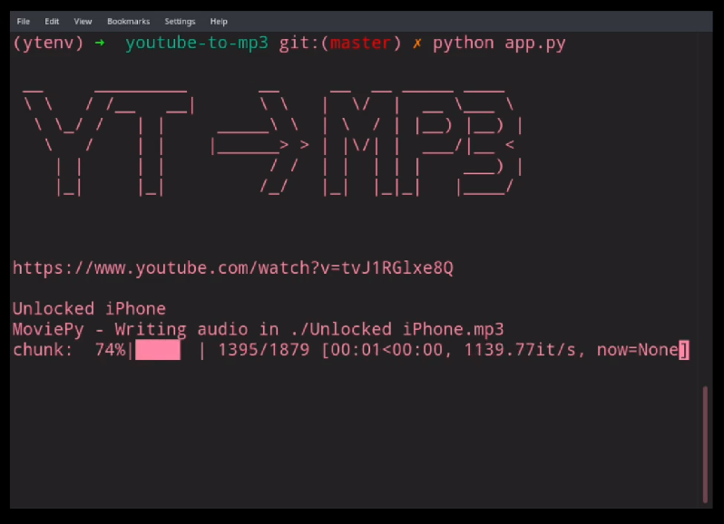

# youtube-to-mp3
Python3 script to bulk download youtube links in .txt file to mp3 format. Embeds artist name and cover image into songs.

# demo (youtube video)

## Setup & Installation
1. Clone this repo (either by SSH-ing or by direct downloading it)
2. Navigate to `youtube-to-mp3` folder which you have downloaded
3. [Create and activate  virtual environment for Python3](https://docs.python.org/3/library/venv.html) I named mine ytenv
4. The requirements are listed in `requirements.txt` You can install these easily by `pip install -r requirements.txt`
5. Install PyTube separately through `python -m pip install git+https://github.com/nficano/pytube` 
6. Populate `links.txt` with the youtube video URLs line by line.
6. Run `python app.py` 

## Notes
- PyTube is always being updated and newer versions of this software are being released due to changes happening in YouTube's internal structure. Feel free to open any issues :)
